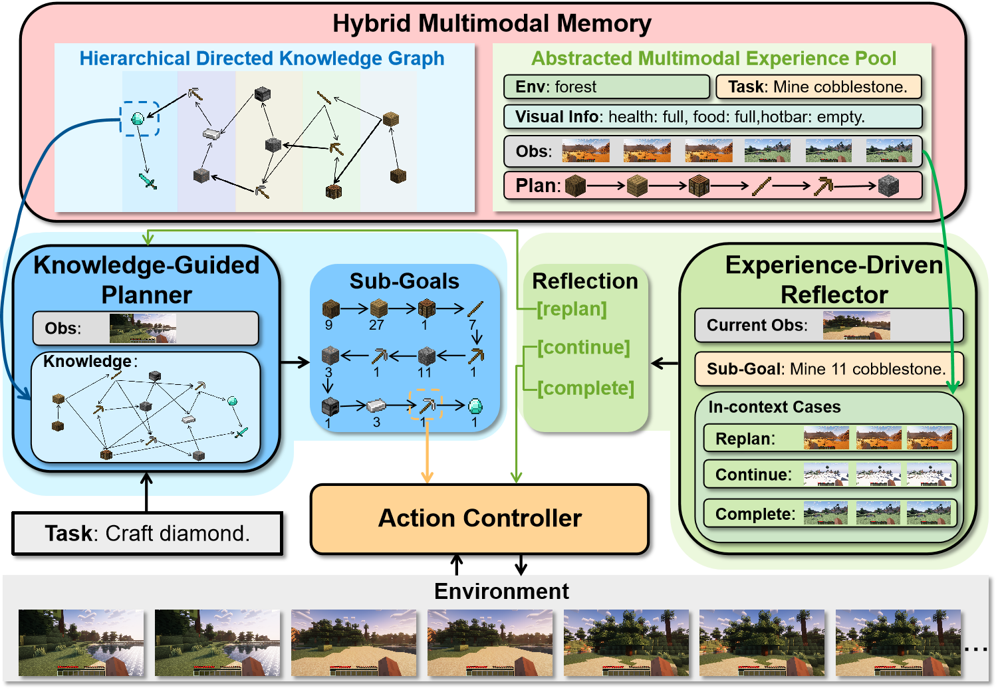
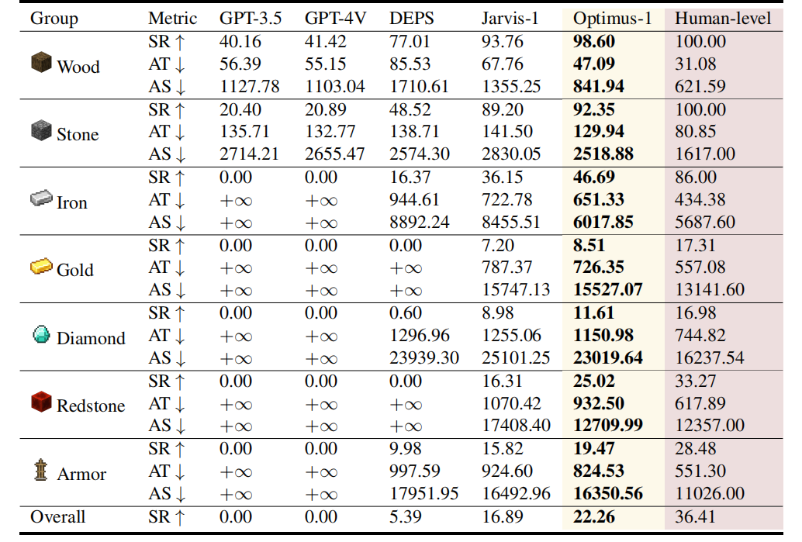

<div align="center">
<h2 align="center">
    <b>Optimus-1: Hybrid Multimodal Memory Empowered Agents 
     <br />  Excel in Long-Horizon Tasks
   <br /> <font size=3>NeurIPS 2024 </font></b> 
</h2>
<div>
<a target="_blank" href="https://scholar.google.com/citations?user=TDBF2UoAAAAJ&hl=en&oi=ao">Zaijing&#160;Li</a><sup>1 2</sup>,
<a target="_blank" href="https://scholar.google.com/citations?user=KO77A2oAAAAJ&hl=en">Yuquan&#160;Xie</a><sup>1</sup>,
<a target="_blank" href="https://scholar.google.com/citations?user=9Vc--XsAAAAJ&hl=en&oi=ao">Rui&#160;Shao</a><sup>1&#9993</sup>,
<a target="_blank" href="https://scholar.google.com/citations?user=Mpg0w3cAAAAJ&hl=en&oi=ao">Gongwei&#160;Chen</a><sup>1</sup>,
<br>
<a target="_blank" href="https://scholar.google.com/citations?hl=en&user=Awsue7sAAAAJ">Dongmei&#160;Jiang</a><sup>2</sup>,
 <a target="_blank" href="https://scholar.google.com/citations?hl=en&user=yywVMhUAAAAJ">Liqiang&#160;Nie</a><sup>1&#9993</sup>
</div>
<sup>1</sup>Harbin Institute of Technology, Shenzhen&#160&#160&#160</span>
<sup>2</sup>Peng Cheng Laboratory, Shenzhen</span>
<br />
<sup>&#9993&#160;</sup>Corresponding author&#160;&#160;</span>
<br/>
<div align="center">
    <a href="https://arxiv.org/abs/2408.03615" target="_blank">
    </a>
    <a href="https://cybertronagent.github.io/Optimus-1.github.io/" target="_blank">
    </a>
</div>
</div>


## :new: Updates
- [11/2024] :fire: We have created a repository to track the latest advancements in [Minecraft agent](https://github.com/dawn0815/Awesome-Minecraft-Agent).
- [10/2024] :fire: We release the presentation [video](https://youtu.be/SWnGs3TXRp0) and [demo](https://youtu.be/NgfDbEdACS8).
- [10/2024] :fire: We release the code. Enjoy it! :smile:
- [09/2024] :fire: Optimus-1 is accepted to **NeurIPS 2024**!
- [08/2024] :fire: [Project page](https://cybertronagent.github.io/Optimus-1.github.io/) released.
- [08/2024] :fire: [Arxiv paper](https://arxiv.org/abs/2408.03615) released.


## Install Dependencies
```shell
# install uv
curl -LsSf https://astral.sh/uv/install.sh | sh
```

```shell
git clone https://github.com/JiuTian-VL/Optimus-1.git
cd Optimus-1
uv sync
source .venv/bin/activate

uv pip install -r requirements.txt

# install java,  clang, xvfb
sudo apt install clang
sudo apt-get install openjdk-8-jdk
sudo apt-get install xvfb

# install mineclip dependicies
uv pip install setuptools==65.5.1 wheel==0.38.0 x_transformers==0.27.1 dm-tree

# install minerl
cd minerl
uv pip install -r requirements.txt
uv pip install -e . # maybe slow
cd ..

# download our MCP-Reborn and compile
# url: https://drive.google.com/file/d/1GLy9IpFq5CQOubH7q60UhYCvD6nwU_YG/view?usp=drive_link
mv MCP-Reborn.tar.gz minerl/minerl
cd minerl/minerl
rm -rf MCP-Reborn
tar -xzvf MCP-Reborn.tar.gz
cd MCP-Reborn
./gradlew clean build shadowJar

# download steve1 checkpoint
# url: https://drive.google.com/file/d/1Mmwqv2juxMuP1xOZYWucnbKopMk0c0DV/view?usp=drive_link
unzip optimus1_steve1_ckpt.zip
```

## How to run
> ! Before running the code, open src/optimus1/models/gpt4_planning.py, change the OpenAI api key to your own key.

1. start the server, Optimus1 connect the MineRL via the server
```shell
bash scripts/server.sh
```
2. test minerl environment
```shell
bash scripts/test_minerl.sh
```
3. test diamond benchmark
```shell
bash scripts/diamond.sh
```


## :balloon: Optimus-1 Framework
We divide the structure of Optimus-1 into Knowledge-Guided Planner, Experience-Driven Reflector, and Action Controller. In a given game environment with a long-horizon task, the Knowledge-Guided Planner senses the environment, retrieves knowledge from HDKG, and decomposes the task into executable sub-goals. The action controller then sequentially executes these sub-goals. During execution, the Experience-Driven Reflector is activated periodically, leveraging historical experience from AMEP to assess whether Optimus-1 can complete the current sub-goal. If not, it instructs the Knowledge-Guided Planner to revise its plan. Through iterative interaction with the environment,Optimus-1 ultimately completes the task.


## :smile_cat: Evaluation results
We report the `average success rate (SR)`, `average number of steps (AS)`, and `average time (AT)` on each task group, the results of each task can be found in the Appendix experiment. Lower AS and AT metrics mean that the agent is more efficient at completing the task, while $∞$ indicates that the agent is unable to complete the task. Overall represents the average result on the five groups of Iron, Gold, Diamond, Redstone, and Armor.


## :hugs: Citation

If you find this work useful for your research, please kindly cite our paper:

```
@inproceedings{li2024optimus,
title={Optimus-1: Hybrid Multimodal Memory Empowered Agents Excel in Long-Horizon Tasks},
author={Li, Zaijing and Xie, Yuquan and Shao, Rui and Chen, Gongwei and Jiang, Dongmei and Nie, Liqiang},
booktitle={NeurIPS},
year={2024}
}
```

## Acknowledgement
- Thanks for these awesome minecraft agents: [VPT](https://arxiv.org/abs/2206.11795), [Voyager](https://arxiv.org/abs/2306.00937), [STEVE-1](https://arxiv.org/abs/2306.00937), [Jarvis-1](https://arxiv.org/abs/2311.05997), etc. Our journey in developing open-world agents began with them.
- Thanks Xinyi Wang for her constructive comments.
